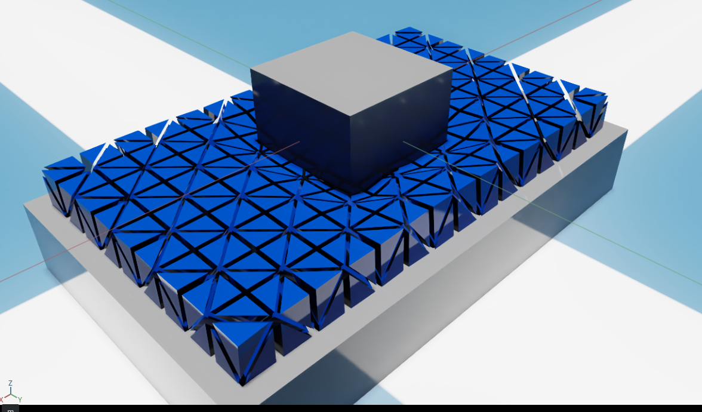

# coro_tactile_isaacsim

## Table of Contents

- [Overview](#overview)
- [Isaac Sim Compatibility](#isaac_sim_compatibility)
- [Installation](#installation)
  - [Prerequisites](#prerequisites)
- [Usage](#usage)
- [Citation](#citation)
- [Contact](#contact)
- [More Information](#more-information)

## Overview

The CoRo extension for Isaac Sim provides a custom user interface panel 
for generating synthetic touch maps. It was developed as a simulation twin 
for the CoRo capacitive touch sensor.

## Isaac Sim Compatibility

This extension is compatible with:

- NVIDIA Isaac Sim 4.5
- NVIDIA Isaac Sim 5.0
- Tested on Linux (Ubuntu 22.04)

## Installation

### Prerequisites

- Python 3.7 or higher
- [customtkinter](https://pypi.org/project/customtkinter/)for the GUI
- [Pandas](https://pypi.org/project/pandas/) for data handling
- [Matplotlib](https://pypi.org/project/matplotlib/) for visualization
- [h5py](https://pypi.org/project/h5py/) for HDF5 file interaction
- [pillow](https://pypi.org/project/pillow/) for image processing and manipulation

### Steps

---

## Features

- User interface panel to interact with the Sensor prim.
- Data generation rate matches simulation refresh rate.
- Automatic generation of CSV files containing essential informatio. 
- User-defined output location for generated files.
- Real-time visualization of synthetic tactile maps. 

---
## Usage

### Typical Workflow

1. Select a primitive in the scene that contains the sensor.

2. The extension identifies the soft object corresponding to the dielectric for file saving.

3. Change the output directory. Default location: /home/User/Documents.

4. Rename the generated files as needed. Default file name: TactileData.

5. In the "Tactile map visualization" section, select the checkbox to enable a 
   real-time viewing for the generated tactile maps.

6. Start the simulation.

7. Stop the simulation to end data saving.


### Notes

- Although only one base file name is required for file generation, two files are created. 
  The first file name will append  "_deformations" to the base name for the sensor-mesh deformation data. 
  The second file name will add "_tactile_maps"  for the file containing the generated tactile maps.

---

## Citation

If you use this extension in your research, please cite the following conference paper:

```bibtex
@article{de2025hybrid,
  title={A hybrid elastic-hyperelastic approach for simulating soft tactile sensors},
  author={De la Cruz S{\'a}nchez, Berith Atemoztli and Roberge, Jean-Philippe},
  journal={Frontiers in Robotics and AI},
  volume={12},
  pages={1639524},
  year={2025},
  publisher={Frontiers Media SA}
}
```


For more information about this project, please visit:

```bibtex
@article{de2025hybrid,
  title={A hybrid elastic-hyperelastic approach for simulating soft tactile sensors},
  author={De la Cruz S{\'a}nchez, Berith Atemoztli and Roberge, Jean-Philippe},
  journal={Frontiers in Robotics and AI},
  volume={12},
  pages={1639524},
  year={2025},
  publisher={Frontiers Media SA}
}
```


```bibtex
@unpublished{BerKwaJea2024,
  title={Tactile Contact Patterns for Robotic Grasping: A Dataset of Real and Simulated Data},
  author={De la Cruz-S{\'a}nchez, Berith Atemoztli and Kwiatkowski, Jennifer and Roberge, Jean-Philippe},
  note         = {Manuscript submitted for publication},
  year={2024},
}
```

---

## Contact
For any questions, suggestions, or feedback, please feel free to reach at:


**Lead Maintainer:**  
**[Berith De la cruz Sanchez]**  
**Email:** [berithcruzs@gmail.com](mailto:berithcruzs@gmail.com)  
**GitHub:** [BerithCS](https://github.com/BerithCS)


<p>

</p>

